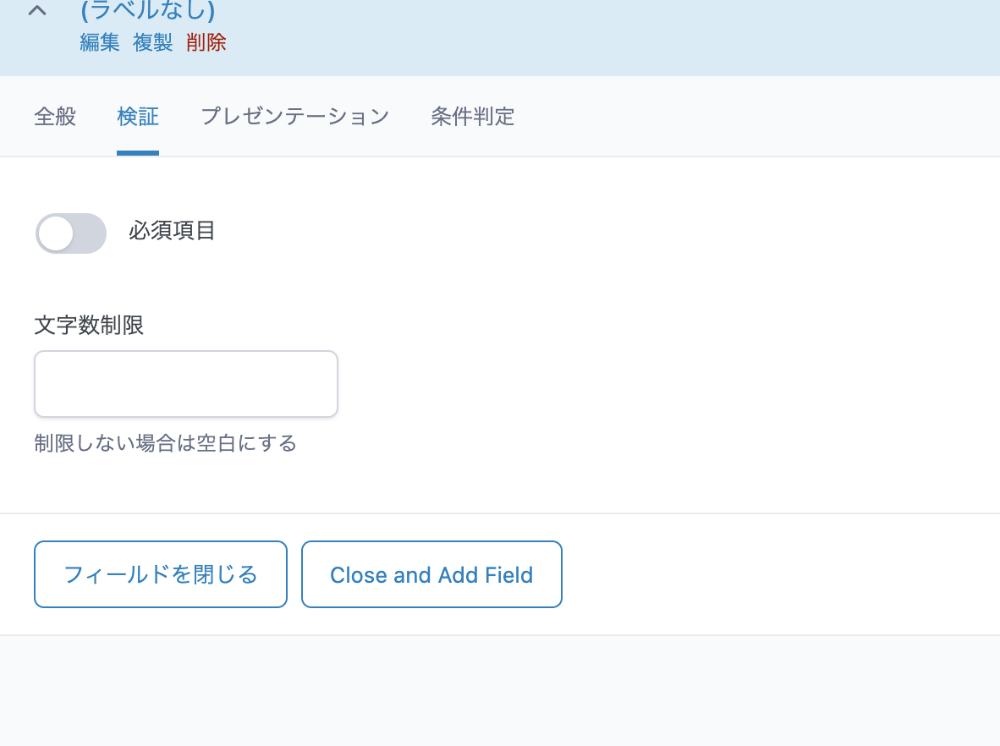

# ACFの使い方

子記事: [カスタムフィールドの値をTwigで取得する](08_カスタムフィールドの値をTwigで取得する.md) 
関連記事: [カスタムブロックの作り方](09_カスタムブロックの作り方.md)

---

## 目次

- [インストール](#インストール)
- [項目の作成手順](#項目の作成手順)
  - [1. カスタムフィールド > 新規追加](#1--カスタムフィールド--新規追加)
  - [2. フィールドグループ名を入力](#2--フィールドグループ名を入力)
  - [3. 各種項目を設定](#3--各種項目を設定)
  - [4. 作成したフィールドグループの表示条件を設定](#4--作成したフィールドグループの表示条件を設定)
  - [5. 表示確認](#5--表示確認)

---

> 本開発環境ではACF PROを活用しています。
> ACFの課金版ですので、**会社もしくは個人がACF課金して、ライセンスを取得していることが前提になります。**
> 
> Wordpressでは、[カスタムフィールドという入力項目を独自に追加](https://fit-jp.com/customfield/)することも可能ですが、ACF（Advanced Custom Fields）を利用した方が直感的かつ柔軟に管理・拡張ができます。
> 
> https://www.advancedcustomfields.com/

## インストール

[▶️初期化から開発スタートまでのフロー](01_初期化から開発スタートまでのフロー.md) でACFはすでにインストールされているはずなので、こちらは割愛します。

## 項目の作成手順

### 1. カスタムフィールド > 新規追加

- **「＋ 新規追加」**をクリックします。

### 2. フィールドグループ名を入力

> ⚠︎ ⚠︎ ⚠︎ 
> フィールドが既に利用されている場合、**フィールド名を変えてしまうとそれまで入れていたデータが消えてしまいます。**
> 
> デプロイ後に変更にならないよう、フィールド名はよく考えて決めましょう。

**👉 命名規則を決めておくと管理しやすくなります。例えば…**

- 投稿の詳細に設定するカスタムフィールドなら `Post: [フィールド名]`
- optionsページに使うカスタムフィールドなら `Option: [フィールド名]`
- カスタムブロックを登録するなら `Block: [フィールド名]`

### 3. 各種項目を設定

1. **全般**
   
   - フィールドタイプ
     - [色々あるので要件に応じて選択](https://www.advancedcustomfields.com/resources/#field-types)
   - フィールドラベル
     - 入力時に管理画面に出すラベル
     - 日本語でも英語でもOK
   - フィールド名
     - 値を取得する際の識別子
     - 半角英数_の組み合わせ

> **optionページに使うフィールド名はグローバルに登録されるので要注意**
> 
> `member`などの汎用的すぎる名前で登録するとどこかで名前空間が競合する恐れがあるため`option—members`のように一意の接頭辞をつけましょう。

2. **検証（バリデーション）**
   
   - 入力時に必須にする
   - 文字数制限を設ける
   - その他フィールドタイプ固有のバリデーションもあります

3. **プレゼンテーション**
   
   - 手順は管理者がフィールドを管理する上で大事な手引きになります。何を入力するのか、どこに表示されるかなどを書きます。**基本的には入力した方が親切**でしょう。
   - プレースホルダー
   - 接頭辞や接尾辞を設定
     - ￥、円、様など

4. **条件判定**
   
   - 特定の条件の時のみ表示を切り替えたい場合に使う
   - 例
     - 求人の募集フラグを切り替えるボタンを設置
     - そのボタンの値が`true(求人を募集する)`の場合のみ募集要項を入力できるようにしたい

### 4. 作成したフィールドグループの表示条件を設定

どんな管理画面にこのフィールドを出すかを設定します。
- `投稿(post)`のブロックのリストに出す
- 特定の固定ページのみに出す
- 上記両方に出す
- オプションページに出す

### 5. 表示確認

想定通りのページにカスタムフィードが表示されていれば設定完了です。

次はサイト上にフィールドの入力内容を反映します。
