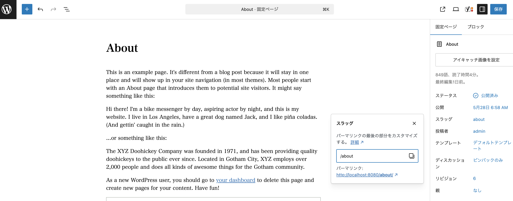

# Twigファイルの作り方

関連記事: [カスタム投稿タイプをつくる](../10_カスタム投稿タイプをつくる/README.md)

---

## 目次

- [固定ページをつくる](#固定ページをつくる)
- [一覧ページ、詳細ページをつくる](#一覧ページ詳細ページをつくる)
- [タクソノミーページをつくる](#タクソノミーページをつくる)
- [参照](#参照)

---

## 固定ページをつくる

会社概要、お問い合わせなどの**一覧ページ、詳細ページが存在しないページです。**

- 管理画面 > 固定ページで、ページを追加します。
- ページのパーマリンクを、任意の文字にして保存します。
  - 例）会社概要ページ → about
    
- `mytheme/views/templates/page-◯◯.twig `を作る。
  - 例）会社概要ページ → page-about.twig
- `page.php` のレンダリング処理により、twigファイルの内容が表示されます。

[固定ページのタイトル、URLなどの取得方法はこちら](固定ページを作る、データを扱う%2024d92a9099dc813aa875f60e4ddd1ffd.html)

## 一覧ページ、詳細ページをつくる

お知らせなどの、**一覧ページ、詳細ページをもつ、投稿に紐づいたページです。**

- まずは下記の手順でカスタム投稿を登録します。カスタム投稿タイプ名を使います。
  - [カスタム投稿タイプをつくる](../10_カスタム投稿タイプをつくる/README.md)
- 2つのファイルを作ります
  1. 一覧: `mytheme/views/templates/archive-[ **カスタム投稿タイプ名** ].twig`
  2. 詳細: `mytheme/views/templates/single-[ **カスタム投稿タイプ名** ].twig`
- `archive.php`、`single.php` のレンダリング処理により、twigファイルの内容が表示されます。

## タクソノミーページをつくる

特定のタクソノミーに該当する記事一覧を表示するページを作成します。

- まずは下記の手順でカスタム投稿を登録します。タクソノミー名を使います。
  - [カスタム投稿タイプをつくる](../10_カスタム投稿タイプをつくる/README.md)
- 以下のテンプレートファイルを作成します。タクソノミー名に応じてファイルを分けられます。
  - `mytheme/views/templates/taxonomy-[ タクソノミー名 ].twig`
- `taxonomy.php` のレンダリング処理により、twigファイルの内容が表示されます。

## 参照

[カスタム投稿タイプをつくる](../10_カスタム投稿タイプをつくる/README.md)
