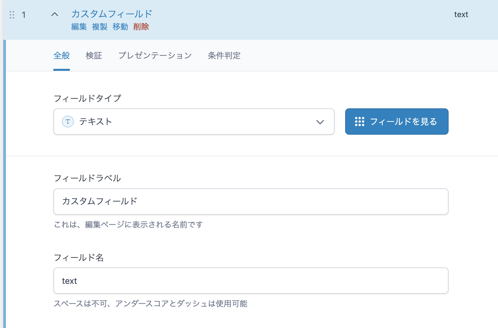
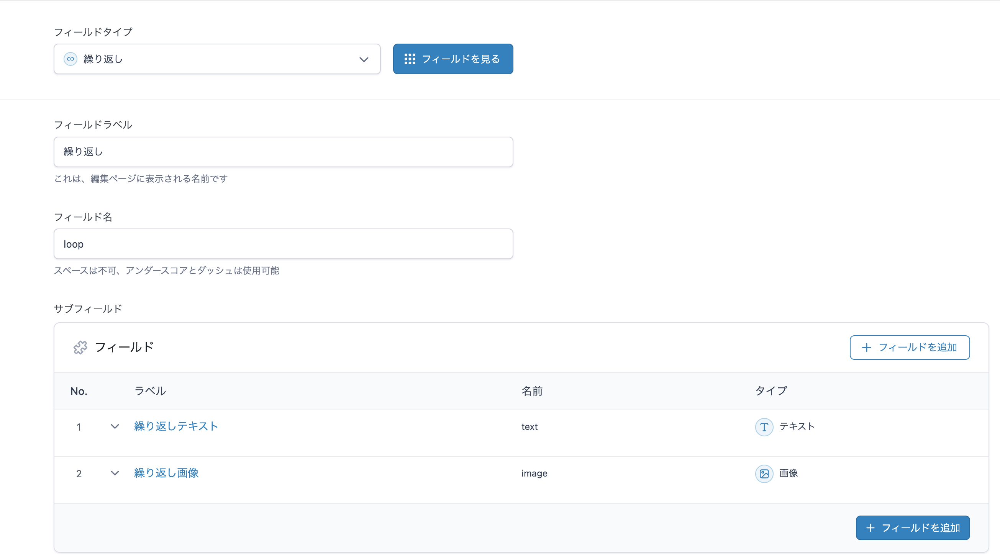
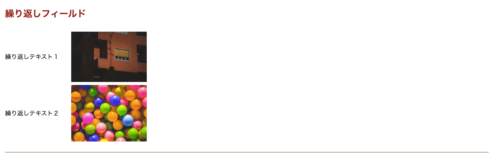
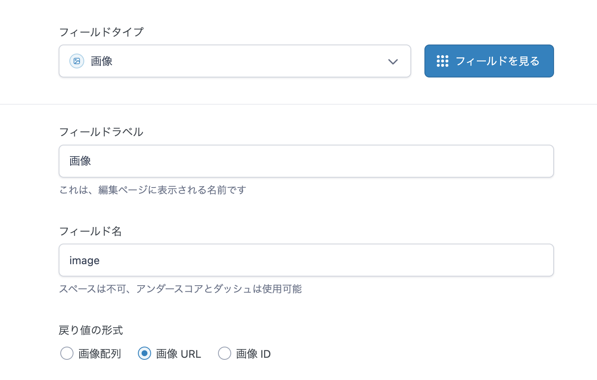
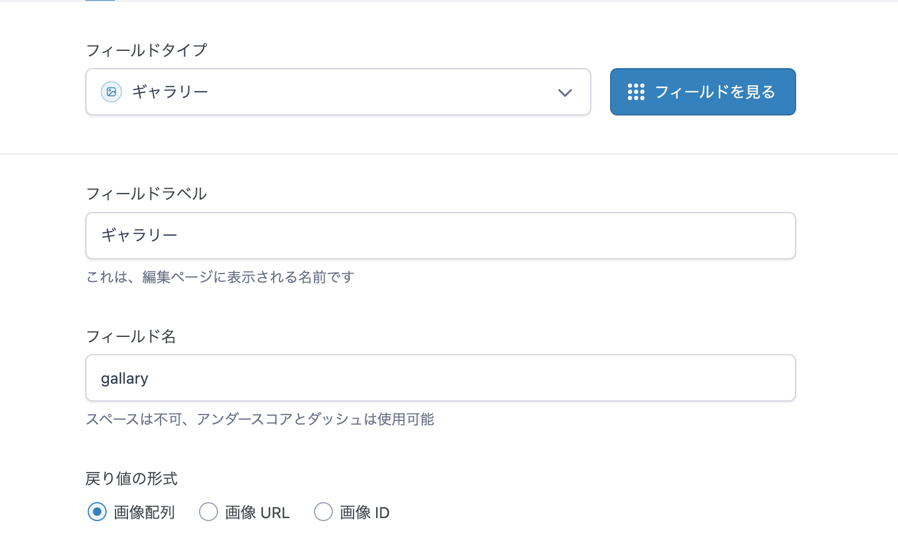
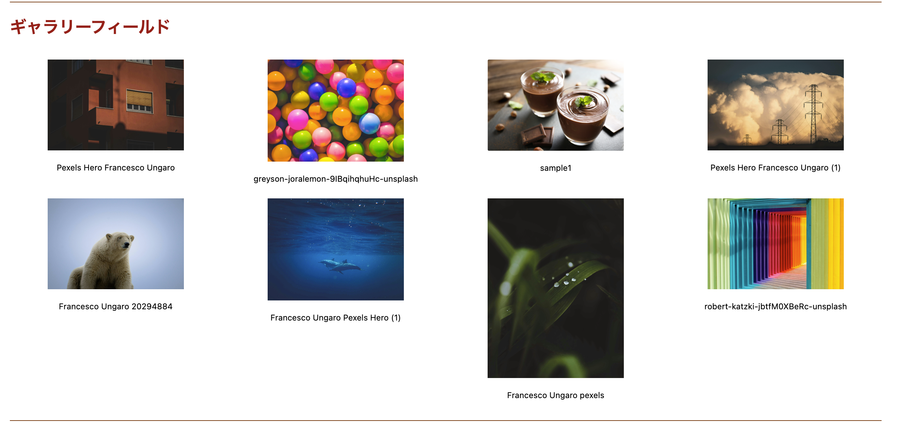
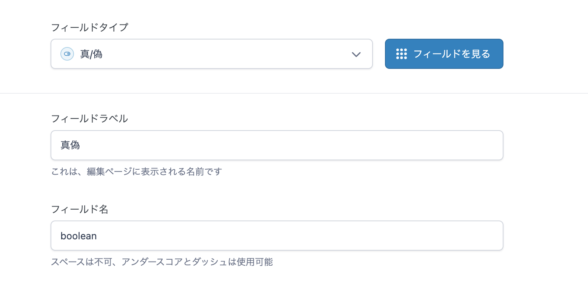
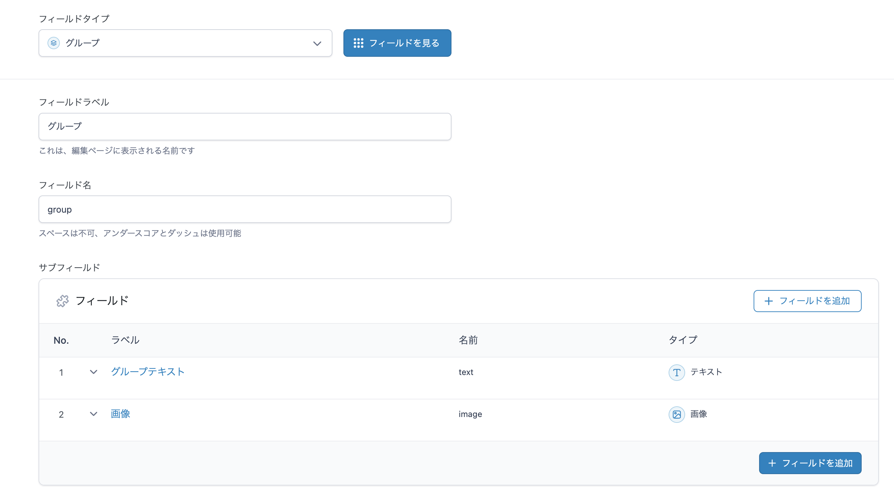
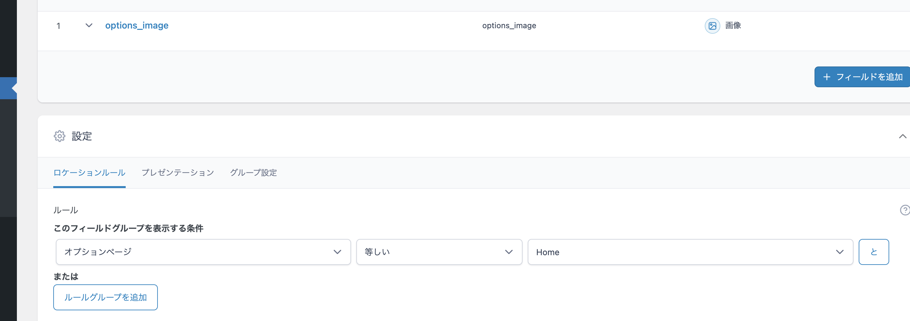

# カスタムフィールドの値をTwigで取得する

関連記事: [カスタムブロックの作り方](09_カスタムブロックの作り方.md)<br>[オプションページの作り方](11_オプションページの作り方.md)<br>
親記事: [ACFの使い方](06_ACFの使い方.md)

---

## 目次

- [準備](#準備)
- [Twigでの使い方](#twigでの使い方)
  - [テキストフィールド](#テキストフィールド)
  - [繰り返しフィールド](#繰り返しフィールド)
  - [画像フィールド](#画像フィールド)
  - [ギャラリーフィールド](#ギャラリーフィールド)
  - [真偽値フィールド](#真偽値フィールド)
  - [グループフィールド](#グループフィールド)
- [オプションページの値を取得](#オプションページの値を取得)
  - [**get_fields('options')の注意点について**](#get_fieldsoptionsの注意点について)

---

## 準備

ACFで作られたカスタムフィールドの取得には、**[get_field()](https://www.advancedcustomfields.com/resources/get_field/)**が使えます。

`mytheme/inc/timber/function.php` にて、Twigファイル上で`get_field()`が使えるように仕込んであります。

```php
// 関数をラップ
// 引数にはフィールド名と投稿IDを渡します。
function twig_acf_get_field($selector, $id = null)
{
	return get_field($selector, $id);
}

// twigで使えるように登録
add_filter("timber/twig", function ($twig) {
	$twig->addFunction(new TwigFunction("get_field", "acf_get_field"));
	return $twig;
});
```

## Twigでの使い方

Twigでは以下のように使用します。

固定ページや詳細ページの場合、get_field()の引数にIDは渡さなくても大丈夫です。

> ⚠️オプションページの内容を取得する場合は、`get_field('loop', 'option')`のように、第２引数に`option`と入力してください。
> 
> → https://www.advancedcustomfields.com/resources/get-values-from-an-options-page/

### テキストフィールド




```php
<div class="py-5">
	<h2 class="text-2xl mb-8 text-red-800 font-bold">テキストフィールド</h2>
	{{ get_field('text') }}
</div>
```

---

### 繰り返しフィールド





```php
<div class="py-5">
	<h2 class="text-2xl mb-8 text-red-800 font-bold">繰り返しフィールド</h2>
	
		<div class="mb-2 flex gap-8 items-center">
			{{ item.text }}
			
		</div>
	
</div>
```

---

### 画像フィールド




```php
<div class="py-5">
	<h2 class="text-2xl mb-8 text-red-800 font-bold">画像フィールド</h2>
	
</div>
```

---

### ギャラリーフィールド





```php
	<div class="py-5">
		<h2 class="text-2xl mb-8 text-red-800 font-bold">ギャラリーフィールド</h2>
		<div class="grid grid-cols-4 gap-3">
			
				<div class="mb-2 flex gap-4 flex-col items-center">
					
					<p class="text-[12px]">{{ item.title }}</p>
				</div>
			
		</div>
	</div>
```

---

### 真偽値フィールド




```php
<div class="py-5">
	<h2 class="text-2xl mb-8 text-red-800 font-bold">真偽値フィールド</h2>
	
		true!
	
</div>
```

---

### グループフィールド




```php
<div class="py-5">
	<h2 class="text-2xl mb-8 text-red-800 font-bold">グループフィールド</h2>
		
	<div class="grid grid-cols-4 gap-3">
		<div class="mb-2 flex gap-4 flex-col items-center">
			
			<p class="text-[12px]">{{ group.text }}</p>
		</div>
	</div>
</div>
```

## オプションページの値を取得

`get_fields( 'options' );`で、オプションページのフィールドの値にアクセスできます。

https://www.advancedcustomfields.com/resources/get_fields/#get-values-from-a-specific-post

`mytheme/inc/timber/context.php` にて以下のような処理をしています。

```php
<?php

use Timber\Timber;

add_filter("timber/context", function ($context) {
	$context["options"] = get_fields("options");
	$context["about_post"] = Timber::get_post([
		"name" => "about",
		"post_type" => "page",
	]);

	return $context;
});
```

これにより、Twig上では`options`で値にアクセスできるようにしています。
例えば、オプションページの`options_image`を取得する場合は以下のようにします。



```php
	<pre>
		{{ dump(options.options_image) }}
	</pre>
```

### **get_fields('options')の注意点について**

> `get_fields('options') `を使うと、**すべてのオプションページのフィールドが混ざって返ってきます**。
> 
> たとえば、以下のような構成があったとします：
> •	メインオプションページ：About
> •	サブオプションページ：Home、Company
> 
> メイン、サブでページが分かれているのですが、これらのページに登録されたフィールドは、すべて `post_id = 'option'` に保存されており、実際には区別されていません。
> 
> そのため、**異なるオプションページで同じフィールド名を使っていると、正しく値を取得できません。**
> 
> 
> オプションページのフィールドには、**ユニークなフィールド名** をつけることをおすすめします。
> 例）　options_[ オプションページ名 ]_text　など…
