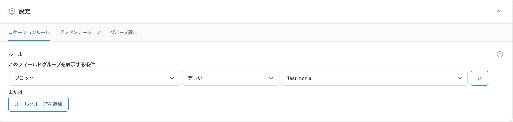

# カスタムブロックの作り方

関連記事: [ACFの使い方](../06_ACFの使い方/README.md)<br>[カスタムフィールドの値をTwigで取得する](../08_カスタムフィールドの値をTwigで取得する/README.md)

---

## 目次

- [作成手順](#作成手順)
  - [ACFのブロックを作成](#acfのブロックを作成)
  - [カスタムブロックの表示](#カスタムブロックの表示)
  - [カスタムフィールドの作成](#カスタムフィールドの作成)
  - [ビューファイルを編集](#ビューファイルを編集)
- [参照](#参照)

---

## 作成手順

### ACFのブロックを作成

```php
npx scaffdog generate acf-block
```

このコマンドを実行すると、対話形式でブロック生成が進みます。

[項目についてはREADMEを参照。](https://github.com/nevers-jp/wordpress-template-v3/blob/f4cebef0dad0e232a2545195b2a82043fc7e665f/README.md?plain=1#L115-L133)

### カスタムブロックの表示

当開発環境では、デフォルトのブロックを全て非表示にして、必要なものだけを登録するようになっています。

作成したブロックを表示させるには、`mytheme/inc/blocks.php` にてブロックを登録します。

**作成したブロック名には自動的にacf/の接頭詞がつくので注意してください。**

```php
/**
 * 使いたいブロックのホワイトリスト
 */
add_filter(
	"allowed_block_types_all",
	function ($allowed_block_types, $block_editor_context) {
		$block_types = [
			"core/paragraph",
			"core/image",
			"core/heading",
			"acf/testimonial",

			// ここにブロックを追加 acf/[ブロック名]
		];
		return $block_types;
	},
	10,
	2
);
```

### カスタムフィールドの作成

管理画面 > ACF > カスタムフィールドで、ブロックの中の入力項目を作ります。

[ACFの使い方](../06_ACFの使い方/README.md)

**このとき、設定 > ロケーションルール > 条件を**
`「ブロック」「等しい」「[ブロック名]」`
**としないと、ブロック内でフィールドが使えません。**



### ビューファイルを編集

`mytheme/views/blocks` にて、該当するブロックのTwigファイルを編集していきます。

以下を参照して、フィールドの値をフロントに表示しましょう。

[カスタムフィールドの値をTwigで取得する](../08_カスタムフィールドの値をTwigで取得する/README.md)

最初からblock\_[ブロック名]クラスが自動付与されますが、識別のためのもので、スタイルを当てているわけではありません。スタイリングにご利用ください。

また、最初から使える変数が４つあります。

- **block**
  - ブロックの設定と属性情報。
- **block_slug**
  - ブロックの名前（acf/を除く）。
- **fields**
  - `fields.[フィールド名]`でフィールドの入力内容を取得できます。
- **is_preview**
  - エディター上のプレビュー表示時は true。

## 参照

[ACF | ACF Blocks with block.json](https://www.advancedcustomfields.com/resources/acf-blocks-with-block-json/)

[block.json のメタデータ](https://ja.wordpress.org/team/handbook/block-editor/reference-guides/block-api/block-metadata/)

ACFのカスタムブロックの設計
