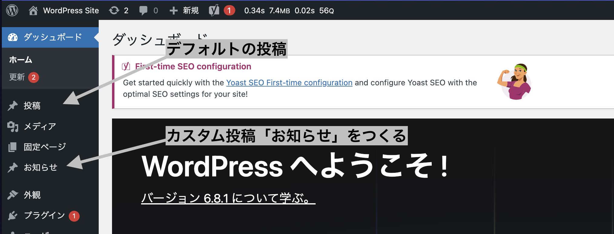

# カスタム投稿タイプをつくる

関連記事: [Twigファイルの作り方](../07_Twigファイルの作り方/README.md)

---

## カスタム投稿タイプとは

デフォルトのWPには`固定ページ(page)`と`投稿(post)`の二つの投稿タイプが用意されています。

ただ、この二つだけだと求められる要件に応えるのが難しいため**カスタム投稿タイプ**を用いて案件に応じて投稿タイプを自由に増やしていきます。

カスタム投稿タイプにカテゴリやタグをつける場合は、独自のタクソノミーである**カスタムタクソノミー**を追加します。

## カスタム投稿タイプをつくる



- `mytheme/inc/posts` に、`[任意の投稿タイプ名 ].php`をつくる

  - 開発環境では、例として`mytheme/inc/posts/mytheme_news.php` をおいています。

- `functions.php` にて呼び出します。
  - `mytheme_news.php` はこのように呼び出してます。

```php
require_once DIR . "/inc/posts/mytheme_news.php";
```

- `[任意の投稿タイプ名 ].php` に以下を書きます。
  - 以下は`mytheme_news.php` ですが、「mytheme_news」の記述を任意の投稿タイプ名に変更してください。
  - https://developer.wordpress.org/reference/functions/register_post_type/　
    こちらを参照し、オプションをいろいろ変更してください。

```php
<?php

namespace WordPressStarter\Theme;

add_action("init", function () {
	register_post_type("mytheme_news", [
		"label" => "お知らせ",
		"public" => true,
		"supports" => ["title", "editor", "thumbnail", "revisions", "page-attributes"],
		"has_archive" => true,
		"show_in_rest" => true,
		"rewrite" => ["slug" => "mytheme_news"],
	]);

	register_taxonomy(
		"mytheme_news_category",
		["mytheme_news"],
		[
			"label" => "カテゴリー",
			"has_archive" => true,
			"show_in_rest" => true,
		]
	);
});

add_action("pre_get_posts", function ($query) {
	if (is_admin() || !$query->is_main_query()) {
		return;
	}

	if (is_post_type_archive("mytheme_news") || is_tax("mytheme_news_category")) {
		$query->set("posts_per_page", 6);
	}
});
```

- `register_post_type` でカスタム投稿タイプ`mytheme_news` を追加
- `register_taxonomy` でカスタムタクソノミー`mytheme_news_category` を追加
- `pre_get_posts` のとこは、一覧ページのときに投稿を6件まで取得する処理。毎回全件取得でパフォーマンスが悪くなるのを防止。

> 管理画面を見てみて、カスタム投稿タイプが表示されていれば成功です👌

## 補遺

案件ごとにカスタム投稿タイプの追加が必須となるため、便宜上それらの設定ファイルをまとめて管理できるように、
`mytheme/inc/posts/ `フォルダを用意しています。
ただし、このフォルダ構成はあくまで便宜上のものであり、`mytheme/inc/posts/[任意の投稿タイプ名].php` が正しく呼び出せるのであれば、必ずしも `posts/ `フォルダにまとめる必要はありません。
