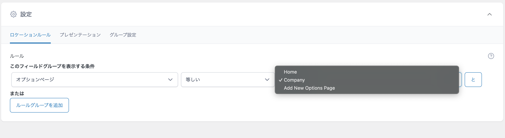

# オプションページの作り方

関連記事: [カスタムフィールドの値をTwigで取得する](../08_カスタムフィールドの値をTwigで取得する/README.md)

---

## 目次

- [オプションページはいつ使う？](#オプションページはいつ使う)
- [オプションページを登録](#オプションページを登録)
  - [👨 acf_add_options_page](#-acf_add_options_page)
  - [👶 acf_add_options_sub_page](#-acf_add_options_sub_page)
- [functions.phpに呼び出す](#functionsphpに呼び出す)
- [カスタムフィールドを作る](#カスタムフィールドを作る)
- [値を取得して表示する](#値を取得して表示する)
- [参考](#参考)

---

> 本開発環境ではACFを活用してオプションページを作成・管理できます。
>
> https://www.advancedcustomfields.com/

## オプションページはいつ使う？

「サイト全体で共通の設定」や「特定の投稿に依存しない情報」を管理したいときに便利です。

たとえば：

- 特定の場所に**任意のNews投稿を3件だけ表示したい**（投稿とは別に手動で選ぶ）
- トップページの**メインビジュアル（KV）スライダーの画像や文言を自由に変えたい**
- サイト全体で使う**電話番号・住所・SNSリンク**などの会社情報を一元管理したい

といった要件で活躍します。

## オプションページを登録

開発環境に最初から入っている`mytheme/inc/options/mytheme_option.php`をコピーします。
ファイル名はなんでも構いませんが、どのオプションページに該当するかわかりやすいものがいいでしょう。

```php
<?php

namespace WordPressStarter\Theme;

/**
 * ACF オプションページのセットアップ
 *
 * -「サイト内CMS」という親メニューを作成
 * - Home、Companyのサブメニューを追加
 */
add_action("init", function () {
	if (!function_exists("acf_add_options_page")) {
		return;
	}

	$parent_slug = "page-settings";
	acf_add_options_page([
		"page_title" => "サイト設定",
		"menu_title" => "サイト内CMS",
		"menu_slug" => $parent_slug,
		"position" => "99",
		"capability" => "edit_posts",
		"redirect" => true,
	]);

	$sub_pages = [
		["page_title" => "Home", "menu_title" => "Home"],
		["page_title" => "Company", "menu_title" => "Company"],
	];

	foreach ($sub_pages as $page) {
		acf_add_options_sub_page(
			array_merge($page, [
				"parent_slug" => $parent_slug,
			])
		);
	}
});
```

### 👨 acf_add_options_page

管理画面に「サイトCMS」などのページを追加するための関数です。

| パラメータ | 説明                                                                                                                                                                                                                   |
| ---------- | ---------------------------------------------------------------------------------------------------------------------------------------------------------------------------------------------------------------------- |
| page_title | ページ自体のタイトル（管理画面のタイトルバーなどに表示）✅ **日本語OK**                                                                                                                                                |
| menu_title | サイドバーに表示されるメニュー名<br/>menu_slugがない場合は⚠️ **日本語不可（URLに利用されるため）**                                                                                                                     |
| menu_slug  | URLに利用されるスラッグ                                                                                                                                                                                                |
| position   | サイドバー内での表示位置                                                                                                                                                                                               |
| redirect   | サブページへのリダイレクトを設定するかどうか<br/><br/>→ true：親メニューをクリックすると、**最初のサブページにリダイレクトされる**（おすすめ）<br/>→ false：親メニュー自体が**独立したオプションページとして機能**する |

### 👶 acf_add_options_sub_page

親オプションページの**配下にサブページを追加**するための関数です。

| パラメータ  | 説明                                                                                               |
| ----------- | -------------------------------------------------------------------------------------------------- |
| page_title  | サブページのタイトル（管理画面の見出しなどに表示）                                                 |
| menu_title  | サイドバーに表示されるメニュー名<br/>menu_slugがない場合は⚠️ **日本語不可（URLに利用されるため）** |
| menu_slug   | URLに利用されるスラッグ                                                                            |
| parent_slug | 親オプションページの menu_slug と一致させる必要がある                                              |

## functions.phpに呼び出す

```php
<?php

require_once __DIR__ . "/inc/options/mytheme_option.php";
```

## カスタムフィールドを作る

以下を参照して、オプションページに表示させるフィールドを追加します。
[ACFの使い方](../06_ACFの使い方/README.md)

**このとき、設定 > ロケーションルール > 条件を**
`「オプションページ」「等しい」「[オプションページ名]」`
**としないと、ページ内でフィールドが使えません。**



## 値を取得して表示する

こちらを参照してください。

## 参考

https://www.advancedcustomfields.com/resources/options-page/

https://www.advancedcustomfields.com/resources/acf_add_options_page/
