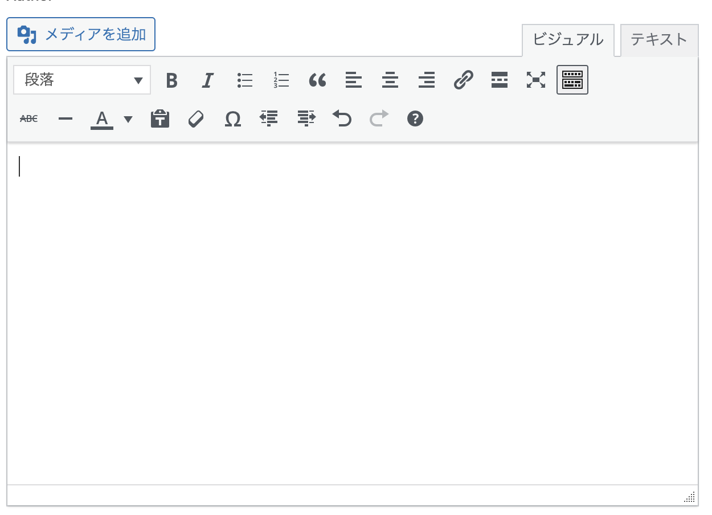
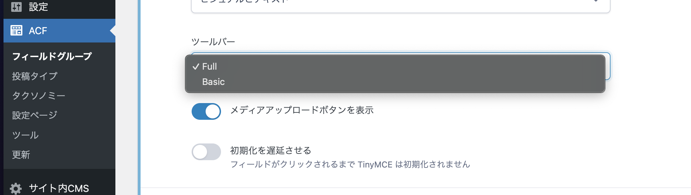
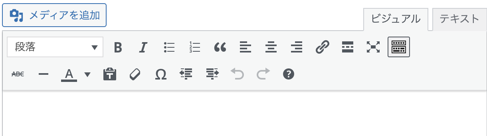
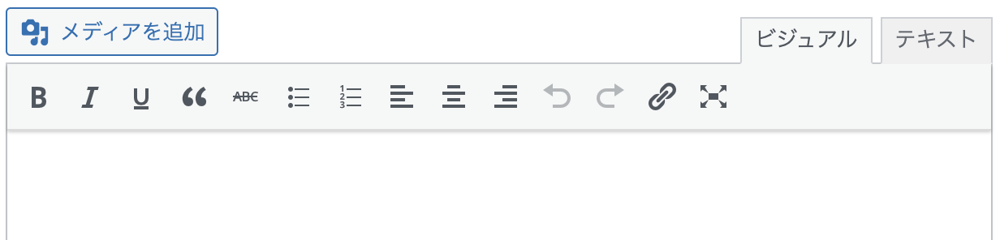
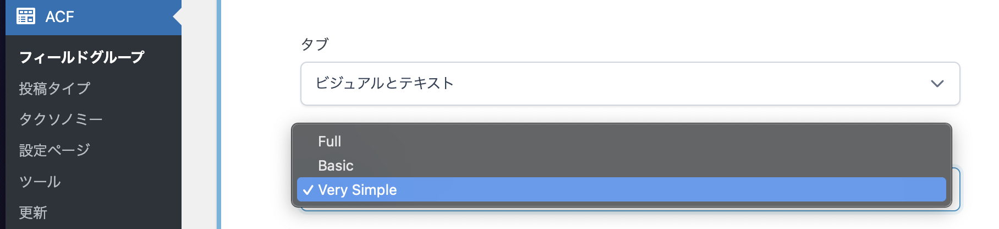
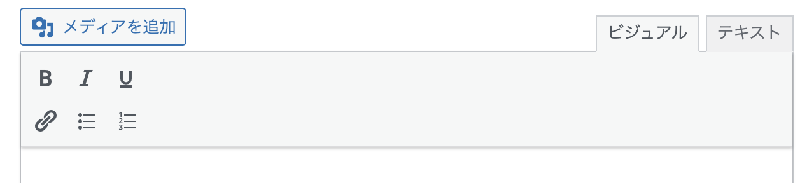

# WYSIWYGエディタのカスタマイズ

---

## 目次

- [WYSIWYGとは](#wysiwygとは)
- [デフォルトの仕様](#デフォルトの仕様)
  - [Fullの場合](#fullの場合)
  - [Basicの場合](#basicの場合)
- [カスタマイズするためのコード](#カスタマイズするためのコード)
  - [関数](#関数)
  - [使用できるツール](#使用できるツール)

---

## WYSIWYGとは

> WYSIWYG (What You See Is What You Get) は、**「見たままが得られる」という意味の略**で、編集画面で表示されているものが、最終的な出力結果とほぼ同じになるように設計されたエディタのことです。



> ACFのフィールドにはWYSIWYGを選択することができます。
> 一つのフィールド内で多様な書式、要素を扱えるのは便利ですが、**そのままでは機能過多で扱いづらいことが多いと思います。**
> WYSIWYGをカスタマイズして、より要件に合ったフィールドを作りましょう。

> 例えば、以下のような時にこの機能を使います。
>
> - **デザインで元々想定している要素タグが限られている。**
>   (スタイリングしていないので崩れのもとになってしまう)
> - **該当のWYSIWYGエリアで利用してほしくない要素がある。**
>   (デザイン性として運用時に利用してほしくないタグ、例えばテーブルなど)

## デフォルトの仕様

ACFではフィールドタイプからWYSIWYGを選択すると、ツールバーが表示されFullとBasicを選択することができます。



### Fullの場合



### Basicの場合



## カスタマイズするためのコード

`mytheme/inc/admin.php` にこのような記述をしてます。

```php
/**
 * ACFのWYSIWYGフィールドにカスタムツールバーを追加
 *  - https://www.advancedcustomfields.com/resources/customize-the-wysiwyg-toolbars/#usage
 */
add_filter("acf/fields/wysiwyg/toolbars", function ($toolbars) {
	/*
		echo '<pre>';
			print_r($toolbars);
		echo '</pre>';
		die;
	*/

	$toolbars["Very Simple"] = [];
	$toolbars["Very Simple"][1] = ["bold", "italic", "underline"]; // WYSIWYG 1行目
	$toolbars["Very Simple"][2] = ["link", "bullist", "numlist"]; // WYSIWYG 2行目

	/*
	"formatselect",
	"bold",
	"italic",
	"bullist",
	"numlist",
	"blockquote",
	"alignleft",
	"aligncenter",
	"alignright",
	"link",
	"wp_more",
	"spellchecker",
	"fullscreen",
	"wp_adv",
	*/

	return $toolbars;
});
```

### 関数

https://www.advancedcustomfields.com/resources/customize-the-wysiwyg-toolbars/

> このフィルターを使用すると、ツールバーを追加、編集、削除できます。

上記の処理では、「Very Simple」というカスタムツールバーを追加し、ツールバーボタンを定義しています。



1行目に`bold`、`italic`、`underline`

2行目に`link`、`bullist`、 `numlist`　を定義しているので、下のように表示されます。



### 使用できるツール

使用できるツールは基本的に [TinyMCE の toolbar オプション](https://www.tiny.cloud/docs/tinymce/6/available-toolbar-buttons/) に準拠します。
