# YoastSEOでmetaを設定する

関連記事: [YoastSEOで使える変数を追加する](../14_YoastSEOで使える変数を追加する/README.md)

---

## 目次

- [YoastSEOとは](#yoast-seoとは)
- [YoastSEOができないこと](#yoast-seoができないこと)
- [YoastSEOのメタ設定](#yoast-seoのメタ設定)
  - [og:image](#ogimage)
  - [titleとdescription](#titleとdescription)
  - [使用できる変数](#使用できる変数)
- [できないことへのアプローチ](#できないことへのアプローチ)
  - [apple-touch-iconの設定](#apple-touch-iconの設定)
  - [faviconの設定](#faviconの設定)

---

## YoastSEOとは

> 本開発環境では、サイトの検索エンジン対策をサポートしてくれるWordPressプラグイン、YoastSEOを使用しています。
> https://ja.wordpress.org/plugins/wordpress-seo/

> YoastSEOは無料版でも多岐にわたる設定が可能です。
>
> - **SEOメタ情報の設定**
> - **XMLサイトマップの自動生成**
> - **構造化データの出力**
> - **ソーシャル連携（OGP & Twitter Card）**
>   - ※下層ページ、投稿ページは課金が必要
> - **検索エンジンインデックスの制御**
>
> 管理画面からメタ設定が可能なため、
> 納品後にクライアント側で設定を変更できるのも便利な点です。

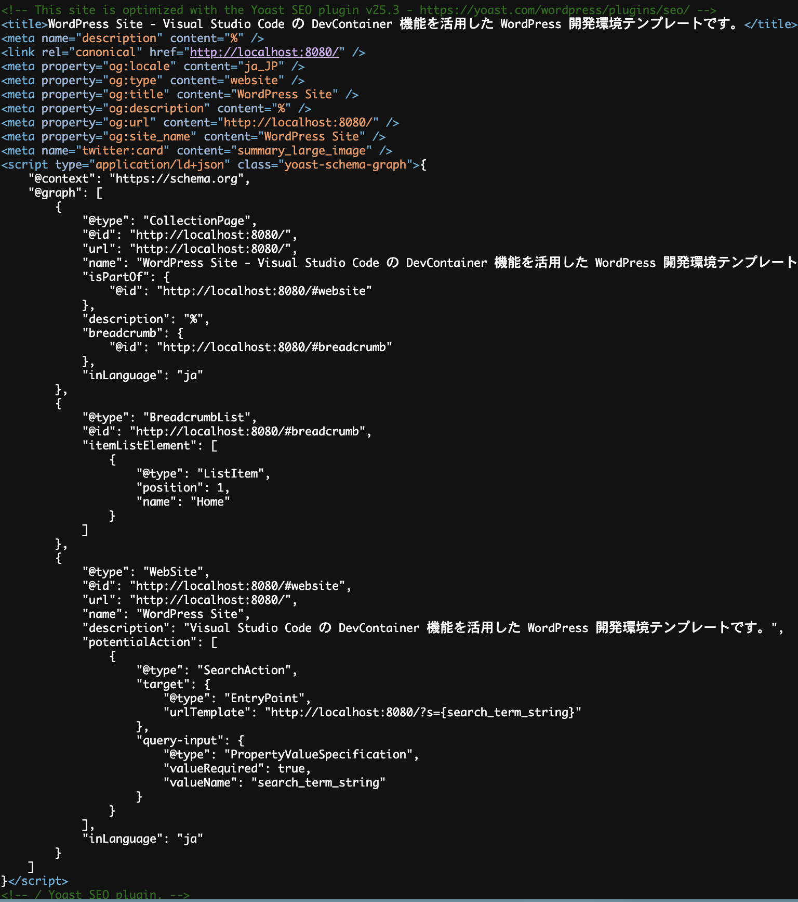

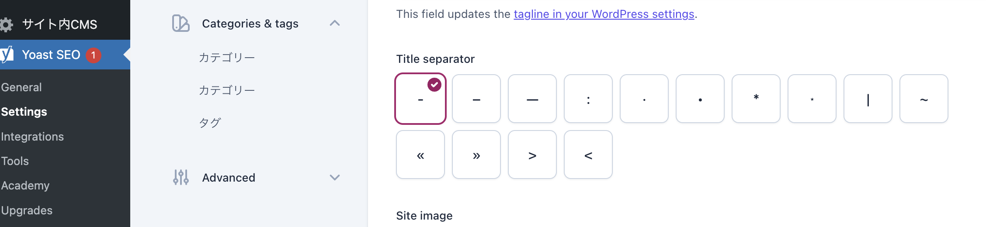

## YoastSEOができないこと

- apple-touch-iconの設定
- faviconの設定（Wordpressの一般設定で可能）

探せば無数にあるかと思いますが、できないとめちゃくちゃ困るみたいなことは恐らくないでしょう。

## YoastSEOのメタ設定

### og:image

Settings > Site basics > Site image にて設定できます。

**これがサイトのベースのog:imageとなり、未設定のページにもこの画像が流用されます。**

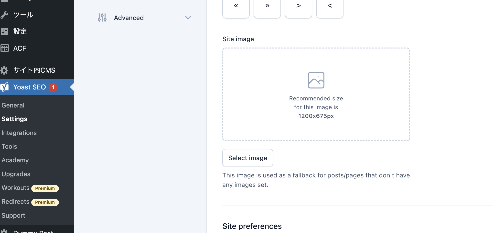

また、YoastSEOをインストールすると、記事やページのエディタの下部に「YoastSEO」のフィールドが表示されます。
ここで、記事やページごとに**個別のog:imageが設定できます。**

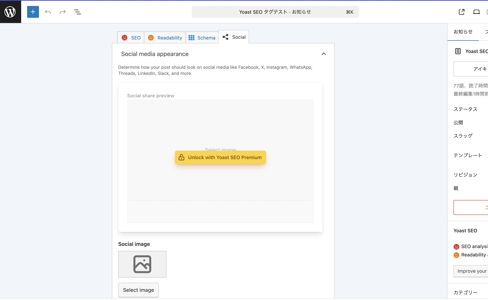

もしog:imageが未設定の場合、**アイキャッチ画像があれば、それを表示します。**

つまり、

> 1. まず、個別に設定したog:imageを参照。
> 2. なければ、アイキャッチ画像をog:imageに参照し利用。
> 3. それでもないなら、サイトのベースのog:imageを参照。

### titleとdescription

Settings > Content typeから、以下のコンテンツのメタ情報の設定が可能です。

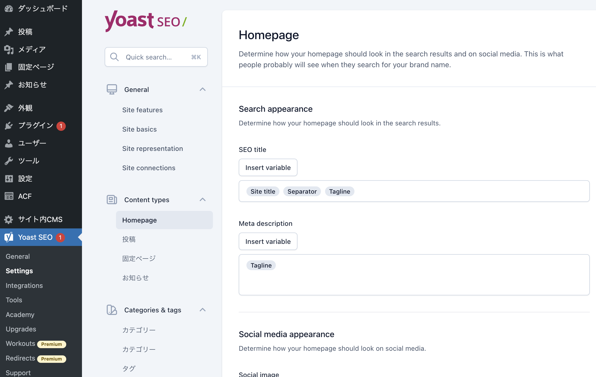

- トップページ
- 固定ページ
- カスタム投稿タイプのアーカイブページ
- カスタム投稿タイプの詳細ページ
- カスタム投稿タイプのタクソノミーページ
- 検索ページ、日付アーカイブページ etc…

変数を組み合わせて出力します。

**トップページの場合**

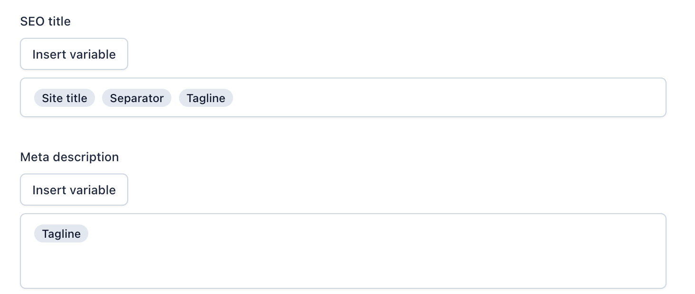

`Site title` … 一般設定 > サイトのタイトル

`Separator` …　Settings > Site basics > Separator　で決めた区切り

`Tagline` …　　一般設定 > キャッチフレーズ

出力… **[会社名]** **|** **[キャッチフレーズ]**

**詳細ページ、固定ページの場合**

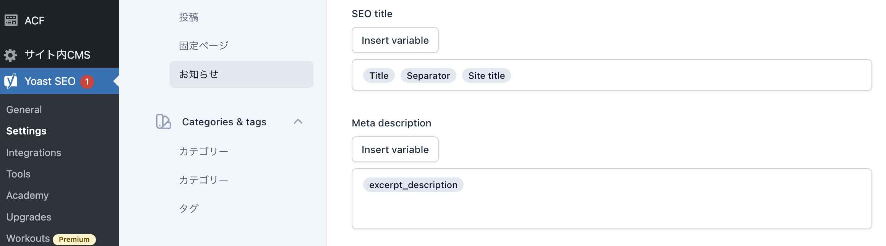

`Title` … 記事、ページのタイトル

`excerpt_description` … カスタム変数。これは記事の内容140文字の抜粋。作り方はこちら。[YoastSEOで使える変数を追加する](../14_YoastSEOで使える変数を追加する/README.md)

**タクソノミーページの場合**

まずは、どのカスタム投稿に紐づいたタクソノミーか確認しましょう。

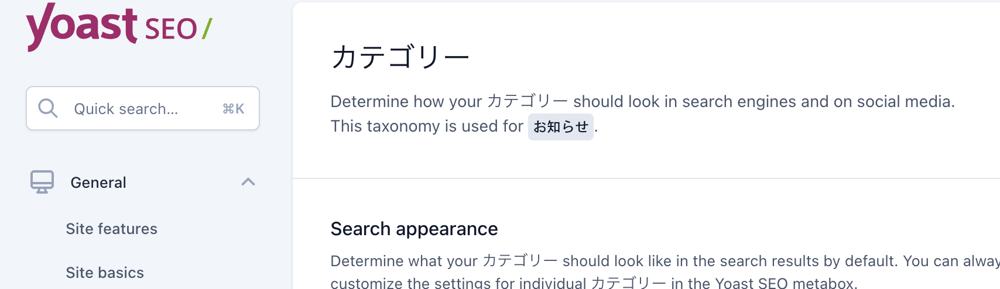

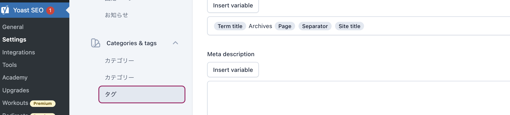

`Term title` … ターム名

初期状態だと「Archives」などの文字が入ってます。

### 使用できる変数

こちらを参照。

https://yoast.com/help/list-available-snippet-variables-yoast-seo/

## できないことへのアプローチ

### apple-touch-iconの設定

- `<head>`内に直接書き足す

```html
<!doctype html>
<html {{ site.language_attributes }}>
	<head>
		<meta charset="{{ site.charset }}" />
		<meta name="viewport" content="width=device-width" />
		<meta name="format-detection" content="telephone=no" />
		{{ function('wp_head') }}
		<link rel="apple-touch-icon" href="{{ assets_path('images/apple-touch-icon.png') }}" /></head
	>.....
</html>
```

- アクションフックで追加する

```php
add_action("wp_head", function () {
	$template_directory = get_template_directory_uri();
	echo '<link rel="icon" type="image/png" href="' .
		$template_directory .
		'/assets/image/favicon.png" sizes="48x48">';
	echo '<link rel="apple-touch-icon" href="' . $template_directory . '/assets/image/webclip.png">';
});
```

### faviconの設定

Wordpressの一般設定で設定できます。

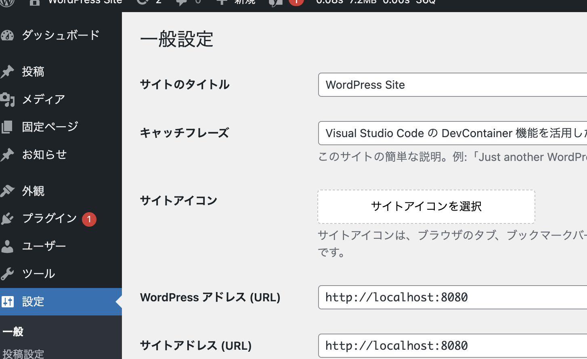

また、外観 > サイトの基本情報　からも設定できます。

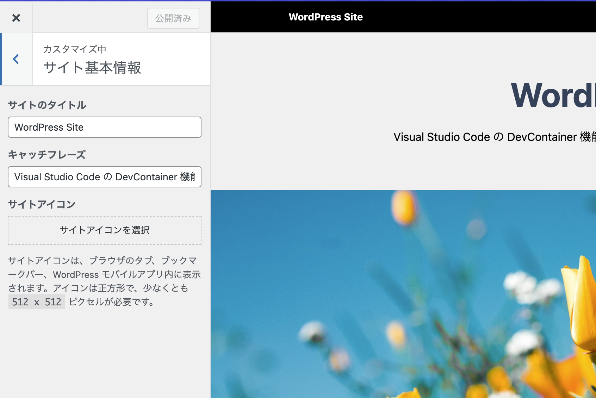
