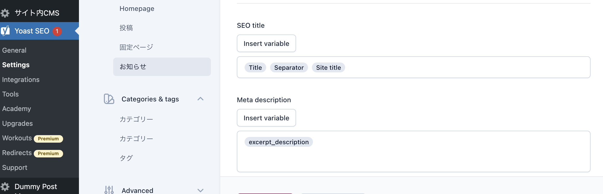

# YoastSEOで使える変数を追加する

関連記事: [YoastSEOでmetaを設定する](13_YoastSEOでmetaを設定する.md)

---

## 目次

- [実際のコード](#実際のコード)
  - [wpseo_register_extra_replacements](#wpseo_register_extra_replacements)

---

> 例えば、YoastSEO利用時に、以下のような場合に対応できます。
> 
> - 記事詳細ページのdescriptionを、記事本文の抜粋にしたい

## 実際のコード

`mytheme/inc/plugin.php` に以下のような記述があります。

```php
/**
 * Yoastのメタ設定に使用する変数を追加
 * - 変数「%%excerpt_description%%」をフィールドに直接入力すること使用できる。
 * @return string 記事本文から抜粋した140文字
 */
add_action('wpseo_register_extra_replacements', function () {
    wpseo_register_var_replacement(
        '%%excerpt_description%%',
        function () {
            $post = Timber\Timber::get_post();

            if (!$post) {
                return '';
            }

            $content = wp_strip_all_tags($post->post_content);
            return mb_substr($content, 0, 140);
        },
        'advanced',
        'First 140 characters of the content, without HTML'
    );
});
```

### wpseo_register_extra_replacements

Yoastの用意した関数で、カスタム変数を追加できる。

**説明**：https://yoast.com/help/list-available-snippet-variables-yoast-seo/

**使用例**：https://gist.github.com/amboutwe/550c10ede7d065d9264930f5480ca748#file-yoast_seo_title_custom-variable-php

上記の例だと、管理画面 > YoastSEO > Settings > 記事のMeta descriptionのフィールドに`%%excerpt_description%%`と打ち込むと、変数として認識され、記事抜粋をdescriptionに設定できる。



